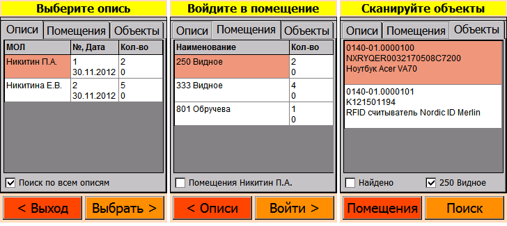
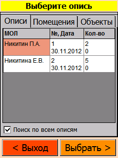
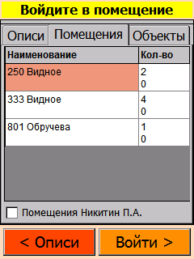
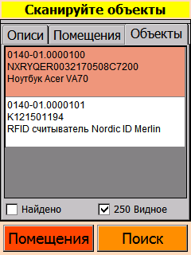

# RFID Инвентаризация ОС

## Как пользоваться

Выберите опись, введите пароль, если он был установлен. Установите флаг «Поиск по всем описям», тогда сканер будет видеть объекты всех загруженных описей, инвертаризация пойдёт веселее.

Отсканируйте метку помещения или выберите его вручную. Для выбора другой описи нажмите «Описи».

Сканируйте объекты в выбранном помещении. Для перехода в другое помещение нажмите «Помещения».

## 1. Область применения

### 1.1. Предназначение

Программа предназначена для проведения автоматизированной инвентаризации основных средств с использованием технологии радиочастотной идентификации RFID UHF EPC Gen 2.0 стандарт ISO 18000-6C и/или технологии штрихкодирования. Основные возможности: высокопроизводительная инвентаризация ОС по множеству материально-ответственных лиц с разделением прав доступа; ручное или автоматическое определение помещений ОС по радиометкам или штрихкодам помещений; запись радиометок ОС и помещений; оперативные отчёты по наличию и отсутствию ОС с учётом помещений. Архитектура программы поддерживает добавление поддержки терминалов сбора данных посредством реализации соответсвущего программного интерфейса. Особенности: открытый исходный код; открытый бинарный формат данных радиометок; открытый формат данных для интеграции с учётными системами Парус и 1С.

### 1.2. Пользователи

В настоящий момент Программное обеспечение используется в бизнес-процессах ОАО "Оргэнергогаз".

## 2. Жизненный цикл

### 2.1. Процессы, обеспечивающие поддержание жизненного цикла Программного обеспечения

ТЕХНИЧЕСКАЯ ПОДДЕРЖКА обеспеченивает процедуры по оцениванию и осуществлению:
1) обновления;
2) местоположения ошибок;
3) исправления, носимые в исходные коды («заплатки», «патчи»);

### 2.2. Устранение неисправностей, выявленных в ходе эксплуатации Программного обеспечения

ТЕХНИЧЕСКАЯ ПОДДЕРЖКА обеспеченивает процедуры для решения проблем функционирования Программного обеспечения:
1) получения проблемы;
2) документирования проблемы;
3) оценивания проблемы;
4) принятия решения по проблеме;
5) отслеживания решения проблемы;
6) по обратной связи в системе регистрации проблем [https://github.com/doomkin/rfidinventory/issues](https://github.com/doomkin/rfidinventory/issues).

Обратная связь документируется и оценивается с целью определения существования проблемы в выпущенном программном обеспечении. Любая такая проблема регистрируется в Отчёте о проблемах. Отчёт о проблемах включает в себя фактические или потенциальные неблагоприятные события и отклонения от спецификации.

## 3. Процессы совершенствования

ИЗГОТОВИТЕЛЬ осуществляет анализ модификации Программного обеспечения:
1) документирует и оценивает обратную связь;
2) осуществляет мониторинг обратной связи выпущенного Программного обеспечения от пользователей;
3) оценивает и одобряет Запросы на изменения, которые модифицируют выпущенное Программное обеспечение;
4) использует программный процесс разработки или установленный процесс ТЕХНИЧЕСКОЙ ПОДДЕРЖКИ для осуществления модификации Программного обеспечения.

## 4. Информация о персонале

Информация о персонале, необходимом для обеспечения поддержания жизненного цикла Программного обеспечения:

* Создание
* Техническая поддержка
* Совершенствование

выполнялись и осуществляются в настоящий момент силами ИЗГОТОВИТЕЛЯ - индивидуального предпринимателя Никитина Павла Александровича, который обладает необходимым набором знаний для работы со всеми компонентами, входящими в состав Программного обеспечения, при решении прикладных задач, соответствующих функционалу Программного обеспечения.

## 5. Нормативные ссылки

При внедрении задач по автоматизации и создании проектно-эксплуатационной документации ИЗГОТОВИТЕЛЬ руководствуется требованиями следующих нормативных документов:

* ГОСТ 34.602-89. Техническое задание. Требования к содержанию и оформлению.
* ГОСТ 34.201-89. Информационная технология. Комплекс стандартов на автоматизированные системы. Виды, комплексность и обозначение документов при создании автоматизированных систем.
* РД 50-34.698-90. Информационная технология. Комплекс стандартов и руководящих документов на автоматизированные системы. Требования к содержанию документов.
* ГОСТ 34.603-92. Информационная технология. Виды испытаний автоматизированных систем.

## 6. Ссылки на реестры

Единый реестр российских программ [RFID Инвентаризация ОС](https://reestr.minsvyaz.ru/reestr/120832/)

Свидетельство о государственной регистрации программы для ЭВМ [поиск по номеру](http://www1.fips.ru/wps/portal/!ut/p/c5/jY5NDoIwGESP1I_SIC5L0bYKFYEqsiEkGgORHyPBwOmFA4jOLCdv8lCKptZ5X9zzrmjq_IESlFqZlDQQe27AAfsA1FaabncWBm5O-8XKGKeCrDwArkIGkjgEC-5gkOY_NHwJhR_0GSVAsqi0W3_oEm9kfVyOR6zGDe7cyPBdOqh1HFxPoXYoG8jr2U9MOr8uGc_7gpMSTXVDbaV134r3BxGsAoA!/dl3/d3/L0lDU0lKSkthWWtLQ2xFS0NsRUpJL29Eb2dBRUlRaGpCS0VRQUNBRVpDZ0dRNEtRcGNFclN0Y1ZhQ0FHTUEvNEMxYjlXX05yeFFERVNaSUpSQ2t5WVNoRVJJX0FBISEvN19JSUFQSEtHMTBPMk0wMEE4TlVBRko2MkdTNS8zODM1MDc4NDUwOTUvYWNOYW1lL2NsaWNrUmVnaXN0ZXIvcmVnTmFtZS9FVk0!/) **2013613741**